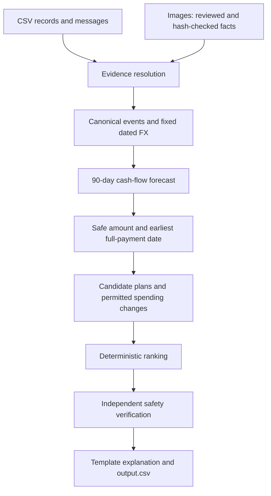

# Buy or Wait?

A financial planning engine that reconstructs evidence and checks purchase plans against a 90-day cash-flow forecast.

[Quickstart](#quickstart) · [Results](#results) · [Implementation](code/README.md) · [Specification](problem_statement.md) · [Submission](SUBMISSION.md)

## What it does

A bank balance alone cannot answer “Can I afford this laptop?” Rent may arrive before salary, a refund may still be pending, and the cheapest payment option may conflict with the user's preferences.

This solution combines CSV records, message evidence, and extracted document facts into a financial timeline. Python calculates the safe amount, generates eligible payment plans, ranks them, and independently replays the recommendation before writing `output.csv`.

**AI helps interpret evidence; code calculates affordability.** The prediction run uses cached image facts and deterministic message parsing, with no model calls or API keys.

The current submission contains 250 validated prediction rows and passes 35 regression tests. On the 25 public examples, payment methods match 22/25, but exact safe amounts match only 3/25. A plan can pass the simulator without matching the organizer's forecast.

## Quickstart

Requires **Python 3.10+**. Runtime dependencies are standard-library only; no package installation is needed. The supplied dataset and image facts are included.

```bash
git clone https://github.com/MaheshBhushan/hackerrank-orchestrate-september26.git
cd hackerrank-orchestrate-september26
python3 code/main.py
```

This generates root-level [output.csv](output.csv), one row for each of the 250 requests, and refreshes the [run report](code/evaluation/run_report.json). Do not confuse it with the blank template at `dataset/output.csv`.

Each prediction includes the safe amount today, recommended method, dated payments, earliest safe full-payment date, permitted spending changes, and an explanation. See the [output schema](problem_statement.md) for exact field definitions.

### Evaluate and verify

Run these commands from the repository root:

```bash
# Compare predictions with the 25 solved public examples.
python3 code/main.py --samples

# Run the regression suite.
PYTHONPATH=code python3 -m unittest discover -s code/evaluation -p 'test_*.py' -v

# Package the implementation and verify the extracted archive.
python3 code/evaluation/package_solution.py
python3 code/evaluation/verify_package.py
```

Archive verification tests both nested `code/` and flat extraction layouts. Each must reproduce the committed predictions without access to solved sample labels or the blank output template.

## Results

Field agreement against **25 public solved examples**, not a held-out benchmark. Numeric formatting differences are normalized by the evaluator.

| Output field | Exact matches | Agreement |
| --- | ---: | ---: |
| Safe amount today | 3/25 | 12% |
| Affordability status | 20/25 | 80% |
| Payment method | 22/25 | 88% |
| Payment schedule | 21/25 | 84% |
| Earliest full-payment date | 19/25 | 76% |
| Spending changes | 20/25 | 80% |

Mean absolute safe-amount error, divided by each request's amount before averaging, is **3.30%**. This avoids combining raw errors across currencies.

All 250 output rows pass the local validator, including independent cash replay for 193 positive recommendations. The other 57 recommend no payment. See [methodology, discrepancies, and limitations](code/evaluation/results.md) and [per-request sample differences](code/evaluation/sample_metrics.json).

> [!WARNING]
> Validation establishes consistency with the reconstructed forecast, not hidden-test accuracy or real-world financial safety. Variable-expense estimates and inferred recurrence remain the main source of uncertainty.

## Architecture



Money uses decimal conversion and integer hundredths. The forecast includes the request day through day 90, counts supported cash events, and protects the user's minimum balance. Pending credits and unrealized investments do not become available cash.

Plans respect payment preferences, supplied installment schedules, and restrictions on flexible recurring expenses. Evidence can amend financial facts; embedded instructions cannot change the planning rules.

The 16 supplied images were reviewed during development, with extracted facts cached in [image_facts.json](code/image_facts.json). Image hashes are checked: unknown, missing, or changed images require new extraction rather than silently becoming zero-valued transactions.

## Documentation

| File | Purpose |
| --- | --- |
| [Implementation guide](code/README.md) | Modules, runtime options, evidence handling, and forecast assumptions |
| [Evaluation report](code/evaluation/results.md) | Verification evidence and unresolved sample disagreements |
| [Usage report](code/evaluation/usage_report.md) | Final-run model usage and development accounting limitations |
| [Run report](code/evaluation/run_report.json) | Input/output hashes, chosen options, and validation traces |
| [Submission checklist](SUBMISSION.md) | Required artifacts and upload instructions |
| [Challenge specification](problem_statement.md) | Authoritative input/output contract and decision rules |

## Limitations and next steps

The expense model uses full-history means and a heuristic for inferring base amounts from reducible-expense floors. Historical cadence also informs recurrence. These are documented assumptions, not a claim to reproduce the organizer's hidden model.

The most useful next improvement is to clarify the expected variable-expense forecasting convention, then test it against new cases. Message parsing is deliberately bounded; new document types and languages require additional extraction support and regression tests.

The final prediction run is offline. AI-assisted development and image review are separate from that run, and their unmetered usage is not claimed to be free.

## Author and acknowledgements

Built by [Mahesh Koduri](https://github.com/MaheshBhushan) for HackerRank Orchestrate, September 2026. Challenge specification and supplied dataset originate from [InterviewStreet's challenge repository](https://github.com/interviewstreet/hackerrank-orchestrate-september26).

No license file is currently declared in this repository. Do not assume reuse permissions for the implementation or supplied challenge data.
